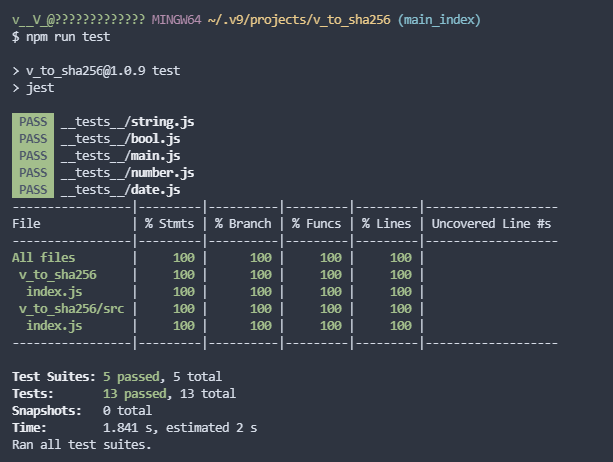

# 👨‍💻 v_to_sha256

🔩 Install using command :

    npm install v_to_sha256

🎭 And save for later re-install :

    npm install v_to_sha256 --save

🪁 How to use:

    const v_to_sha256 = require("v_to_sha256");

    console.log(await v_to_sha256("demo_password_123456"))  //-> returns hash : 4491875b6270ce2dd38068c03e1ce0251e06396cddb5fe87f51fe1024bfceb1a
    console.log(v_to_sha256.sync("demo_password_123456")) //-> Shoud be same :)

## ✅ Test Results and Coverage with Jest

📑 Related links :

* [v_to_md5](https://www.npmjs.com/package/v_to_md5) ⏭ MD5 hash generator
* [v_is_empty_value](https://www.npmjs.com/package/v_is_empty_value) ⏭ check if empty entry
* [v_file_system](https://www.npmjs.com/package/v_file_system) ⏭ simple and safe fs module with sync and promises
* [v_execute](https://www.npmjs.com/package/v_execute) ⏭ Exec cli commands
* [v_scrolls](https://www.npmjs.com/package/v_scrolls) ⏭ Readme Generator
* [v_database](https://www.npmjs.com/package/v_database) ⏭ single database solution
* [v_database_cli](https://www.npmjs.com/package/v_database_cli) ⏭ v_database cli tool
